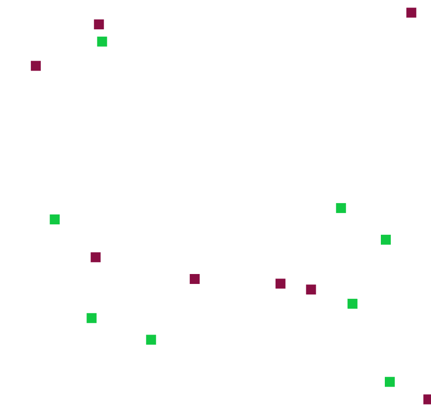
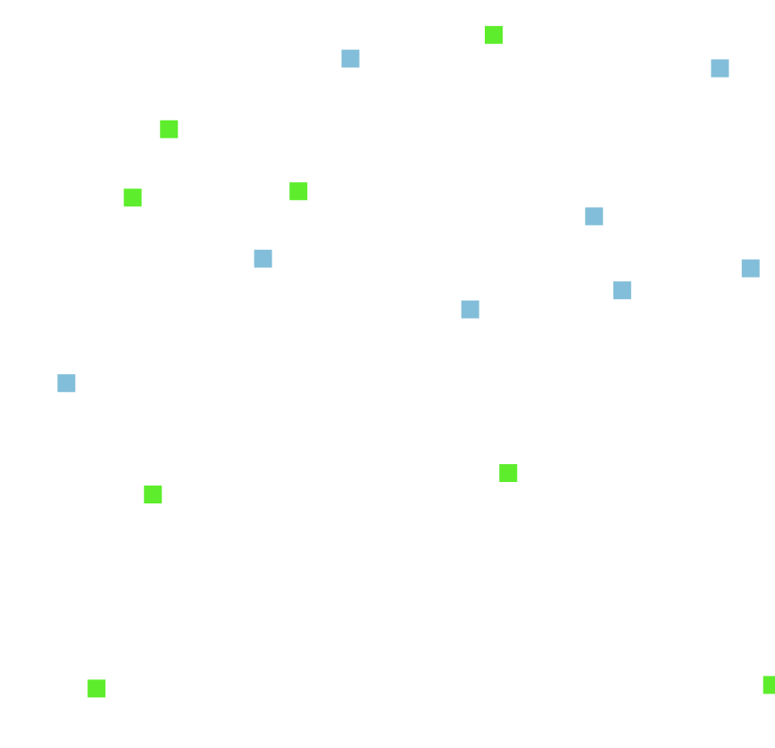
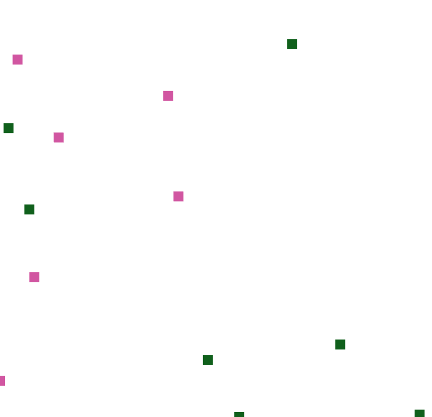

# Abstract
This repo contains the content for the project course DD2444
* Boid simulation on CPU and GPU
* WebGL 2.0 Compute

# Introduction

Modern browsers such as Google Chrome are getting more sophisticated as time passes and gets introduced with more functionality. One benefit of using a modern browser is that you can run the same application on different platforms. With HTML 5 we have access to [Web Graphics Library (WebGL)](https://developer.mozilla.org/en-US/docs/Web/API/WebGL_API) in the browser with the help of JavaScript. WebGL is a hardware-based rendering that utilizes the GPU on the clients' machine. One drawback with WebGL is that it doesn't support General Purpose GPU (GPGPU) applications. Fortunately, we have access to [WebGL 2.0 Compute](https://www.khronos.org/registry/webgl/specs/latest/2.0-compute/). It can be accessed in developer mode in Google Chrome or Windows Microsoft Edge. With WebGL 2.0 Compute we have access to compute shaders. They are used for arbitrary computations, which means that they don't have to be connected to the graphics pipeline directly. This research compares performance on similar implementations of Reynold Boids [1,2] on the CPU and GPU during real-time simulations.

## Research Questions
* How suited are global and local tasks for agents in parallel computations?
* How well does it scale in terms of the number of groups and group size?
* How large can the groups be for real-time simulations in the browser?

# Background

Reynold Boids [1,2] is an early attempt to model flocks of birds, known as boids, with some simple rules. The boids should be separated and thus not collide; They should be aligned and stay within the flock; They should follow a global objective. The idea of model flocks of birds could be applied to other applications such as simulating crowds.

Simulating virtual crowds with multiple agents is of interest in many applications since it could help us with urban planning, social science and so forth [4]. A single agent has the possibility to be aware of its local surroundings while it follows some global goals [5]. The local goals could be connected to follow a specific group or adjusting velocity and speed depending on one's surroundings. Simulating virtual crowds is not that far away from Reynold Boids. This project will look at the possibility to outsource computations to the graphics card in a modern browser when simulating behaviors of crowds.

## Reynold Boids
The algorithmic aspects of the boid simulation follows three rules or steering behaviors.

##### Rule 1 - Cohesion
The first rule makes the boids to move to the "center of mass" or average position of the group they belong to. The animation below contains of two groups where each individual boid steers to the average position of the group. [1,2]



Animation of Rule 1


##### Rule 2 - Separation
The second rules steers each boid so they avoid crowding. In the animation below the boids first moves to the average position of the group. If they get to close they steer away to avoid crowding. [1,2]



Animation of Rule 1&2

##### Rule 3 - Alignment
In alignment each boid steers to the average heading of the group they belong to. In the animation below we can see that the boids adapts to the average heading of the group. [1,2]


Animation of Rule 3

[1,2]

## Compute Shaders
Compute shaders is a shader stage for arbitrary computation [8].

### Compute Space

#### Work-Group


The smallest unit of a compute shader is a Work-Group [9].

#### Work-Groups


Work-Groups contains the Work-Items [6]. The execution order of the works groups can be arbitrary so it is important that they can be processed individually [8]. There exist shared variables within a Work-Group so communication is suitable here. Communication between Work-Groups might deadlock the system [8].


To get good performance it is of high importance to get the right amount of occupancy. The threads of the Work Groups run in parallel, so the Work-Items per Work Groups will impact performance. [7]

#### Limitations of Compute Space


TODO: https://www.khronos.org/opengl/wiki/Compute_Shader

### Shader Storage Buffer Object
Shader Storage Buffer Objects (SSBO) can hold arbitrary data and compute shaders can read and write to them in parallel.
[6]

# Method

## Initialization
Before entering the computations the random initialization for the boids is done on the CPU.

## Algorithm
The CPU and GPU implementation of the Reynold Boids are inspired by the pseudocode provided by [3].

---
Rule 1 - Cohesion
```
PROCEDURE rule1(boid bJ)

		Vector pcJ

		FOR EACH BOID b
			IF b != bJ THEN
				pcJ = pcJ + b.position
			END IF
		END

		pcJ = pcJ / N-1

		RETURN (pcJ - bJ.position) / 100

END PROCEDURE

```
Pseudocode provided by [3].

---
Rule 2 - Separation

```
PROCEDURE rule2(boid bJ)

		Vector c = 0;

		FOR EACH BOID b
			IF b != bJ THEN
				IF |b.position - bJ.position| < 100 THEN
					c = c - (b.position - bJ.position)
				END IF
			END IF
		END

		RETURN c

END PROCEDURE
```
pseudocode provided by [3].

---
Rule 3 - Alignment
```
PROCEDURE rule3(boid bJ)

		Vector pvJ

		FOR EACH BOID b
			IF b != bJ THEN
				pvJ = pvJ + b.velocity
			END IF
		END

		pvJ = pvJ / N-1

		RETURN (pvJ - bJ.velocity) / 8

END PROCEDURE
```
pseudocode provided by [3].

---
#### Other
* The velocity to was controlled to be within reasonalbe limits during simulations.
* If a boid moved out of bounds, it was moved to the other side of the screen in the simulation.
* The constants in the pseudocode were adapted to each implementation.

## Visuals
The visuals are kept to a minimum since the focus lies on performance on the algorithm. Therefore each boid is represented by a colorful square. Each group of boids has a distinct color randomly selected.

## CPU Implementation

### Calculations
Calculations in javaScript

### Rendering
Pass the data to WebGL and then render.

## GPU Implementation

### Calculations
Compute shaders are not part of the rendering pipeleine, they are executed before. After the dispatch function the memory barrier function is called to ensure that the calculations are complete.

After that the vertex shader can read from the SSBO.

### Rendering

WebGL 2.0

## Performance
Performance is measured by increasing GROUPS and GROUP_SIZE.

## Algorithmic considerations
The purpose of this implementation is not to capture any realistic motion or decision making of the boids. Its intention is to compare similar workload of a sequential compared to a parallel implementation on the GPU. when it comes to
stateless,

## Software
Google Chrome x.x.x
## Hardware
GPU: Geforce x.x

CPU: AMD x.x.x


# Results
 Plots of fps
 The animation ran for one minute and the average FPS was measured.


 **Without Drawing**

 `Groups size: 8`

 | Number of Groups        | 100 | 1000 |10000 |
 | :-------------: |:-------------:| :-----:|:---: |
 | CPU (fps)     | 260 | 238 | 32 |
 | GPU (fps)     | |  | |

 `Groups size: 64`

 | Number of Groups        | 100 | 1000 |10000 |
 | :-------------: |:-------------:| :-----:|:---: |
 | CPU (fps)     | 58 | 5.56 | 0.58 |
 | GPU (fps)     | |  | |


 `Groups size: 128`

 | Number of Groups        | 100 | 1000 |10000 |
 | :-------------: |:-------------:| :-----:|:---: |
 | CPU (fps)     |14.7 |1.41 | 0.14 |
 | GPU (fps)     | |  | |

---
 **With Drawing**

 `Groups size: 8`

 | Number of Groups        | 100 | 1000 |10000 |
 | :-------------: |:-------------:| :-----:|:---: |
 | CPU (fps)     | 260 | 157 | 13.5 |
 | GPU (fps)     | |  | |

 `Groups size: 64`

 | Number of Groups        | 100 | 1000 |10000 |
 | :-------------: |:-------------:| :-----:|:---: |
 | CPU (fps)     | 41 | 4.45 | 0.45 |
 | GPU (fps)     | |  | |


 `Groups size: 128`

 | Number of Groups        | 100 | 1000 |10000 |
 | :-------------: |:-------------:| :-----:|:---: |
 | CPU (fps)     | 11.02 | 1.07 | 0.11 |
 | GPU (fps)     | |  | |


# Discussion


## Optimization
Shared memory inside the work group.

# Conclusion


# References
[1] Craig W. Reynold's home page, http://www.red3d.com/cwr/

[2] Craig  W  Reynolds.   Flocks,  herds  and  schools:   A  distributed  behavioralmodel.  InProceedings of the 14th annual conference on Computer graphicsand interactive techniques, pages 25–34, 1987

[3] Conrad Parker's boid page, http://www.kfish.org/boids/ , http://www.kfish.org/boids/pseudocode.html

[4] Avneesh Sud, Russell Gayle, Erik Andersen, Stephen Guy, Ming Lin, andDinesh Manocha. Real-time navigation of independent agents using adaptiveroadmaps.  InACM SIGGRAPH 2008 classes, pages 1–10. 2008.

[5] Rahul Narain, Abhinav Golas, Sean Curtis, and Ming C Lin. Aggregate dynamics for dense crowd simulation. InACM SIGGRAPH Asia 2009 papers,pages 1–8. 2009.

[6] Bailey, Mike. "OpenGL Compute Shaders." Oregon State Un iversity, http://web. engr. oregonstate. edu/~ mjb/cs557/Handouts/compute. shader. 1pp. pdf (2016).

[7] Gunadi, Samuel I., and Pujianto Yugopuspito. "Real-Time GPU-based SPH Fluid Simulation Using Vulkan and OpenGL Compute Shaders." 2018 4th International Conference on Science and Technology (ICST). IEEE, 2018.

[8] Kronos, https://www.khronos.org/opengl/wiki/Compute_Shader

[9] ARM Developer Center, https://arm-software.github.io/opengl-es-sdk-for-android/compute_intro.html
