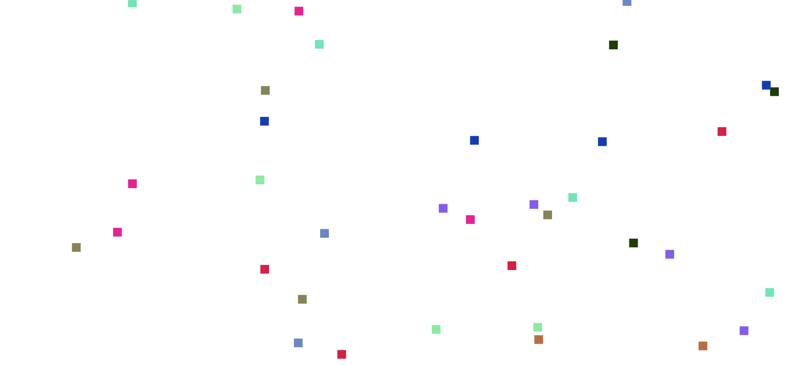

# DD2444 - PROJECT COURSE IN SCIENTIFIC COMPUTING

This repo contains the content for the project course DD2444

## Reynold Boids

##### Rule 1 - Cohesion

Animation of Rule 1

##### Rule 2 - Separation

Animation of Rule 1,2

##### Rule 3 - Alignment

Animation of Rule 3

##### Simulation

How boids moves in a simulation is trivially determined by the implementation and interpretation of the rules above.

To demonstrate a full simulation with all rules applied, see below.

Simulation of Rule 1,2,3 applied with 10 groups and 4 boids in each group. See report for implementation details.
