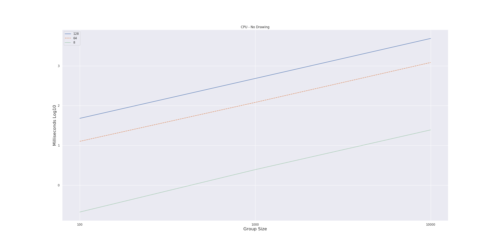
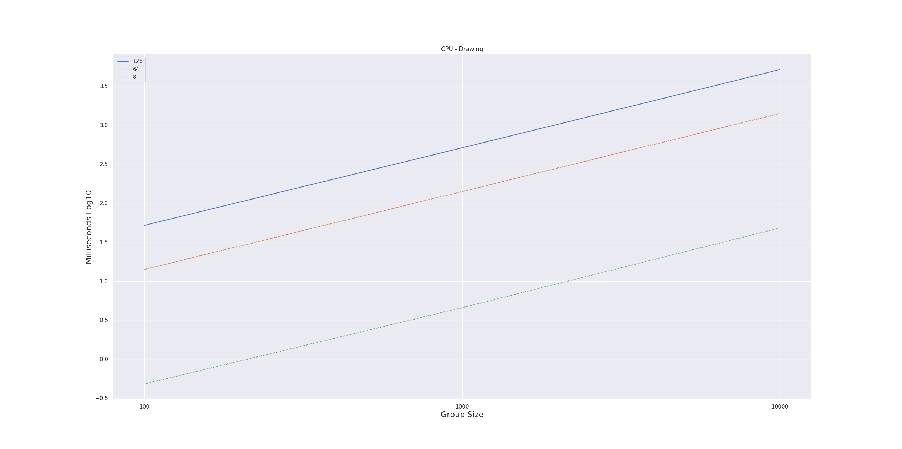
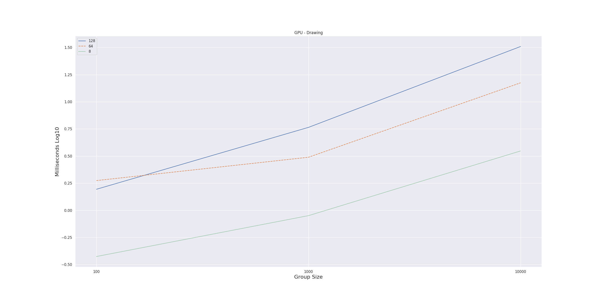

# Abstract
This repo contains the content for the project course DD2444
* Boid simulation on CPU and GPU
* WebGL 2.0 Compute

# Introduction

Modern browsers such as Google Chrome are getting more sophisticated as time passes and gets introduced with more functionality. One benefit of using a modern browser is that you can run the same application on different platforms. With HTML 5 we have access to [Web Graphics Library (WebGL)](https://developer.mozilla.org/en-US/docs/Web/API/WebGL_API) in the browser with the help of JavaScript. WebGL is a hardware-based rendering that utilizes the GPU on the clients' machine. One drawback with WebGL is that it doesn't support General Purpose GPU (GPGPU) applications. Fortunately, we have access to [WebGL 2.0 Compute](https://www.khronos.org/registry/webgl/specs/latest/2.0-compute/). It can be accessed in developer mode in Google Chrome or Windows Microsoft Edge. With WebGL 2.0 Compute we have access to compute shaders. They are used for arbitrary computations, which means that they don't have to be connected to the graphics pipeline directly. This research compares performance on similar implementations of Reynold Boids [1,2] on the CPU and GPU during real-time simulations.

## Research Questions
* How suited are global and local tasks for boids in parallel computations?
* How well does it scale when changing group size and how many groups?
* How does group size impact performance for compute shaders?
* Can many groups of boids run in the browser with real time performance?

# Background

Reynold Boids [1,2] is an early attempt to model flocks of birds, known as boids, with some simple rules. The boids should be separated and thus not collide; They should be aligned and stay within the flock; They should follow a global objective. The idea of model flocks of birds could be applied to other applications such as simulating crowds.

Simulating virtual crowds with multiple agents is of interest in many applications since it could help us with urban planning, social science and so forth [4]. A single agent has the possibility to be aware of its local surroundings while it follows some global goals [5]. The local goals could be connected to follow a specific group or adjusting velocity and speed depending on one's surroundings. Simulating virtual crowds is not that far away from Reynold Boids. This project will look at the possibility to outsource computations to the graphics card in a modern browser when simulating behaviors of crowds.

## Reynold Boids
The algorithmic aspects of the boid simulation follows three rules or steering behaviors.

##### Rule 1 - Cohesion
The first rule makes the boids to move to the "center of mass" or average position of the group they belong to. The animation below contains of two groups where each individual boid steers to the average position of the group they belong to. [1,2]

The CPU and GPU implementation of the Reynold Boids are inspired by the pseudocode provided by [3].


```
PROCEDURE rule1(boid bJ)

		Vector pcJ

		FOR EACH BOID b
			IF b != bJ THEN
				pcJ = pcJ + b.position
			END IF
		END

		pcJ = pcJ / N-1

		RETURN (pcJ - bJ.position) / 100

END PROCEDURE

```
Pseudocode provided by [3].


Animation of Rule 1


##### Rule 2 - Separation
The second rules steers each boid so they avoid crowding. In the animation below the boids first moves to the average position of the group. If a boid gets to close to other members in the group it steers away to avoid crowding. [1,2]

```
PROCEDURE rule2(boid bJ)

		Vector c = 0;

		FOR EACH BOID b
			IF b != bJ THEN
				IF |b.position - bJ.position| < 100 THEN
					c = c - (b.position - bJ.position)
				END IF
			END IF
		END

		RETURN c

END PROCEDURE
```
Pseudocode provided by [3].


Animation of Rule 1,2

##### Rule 3 - Alignment
In alignment each boid steers to the average heading of the group they belong to. In the animation below, the boids adapts to the average heading of the group. [1,2]

```
PROCEDURE rule3(boid bJ)

		Vector pvJ

		FOR EACH BOID b
			IF b != bJ THEN
				pvJ = pvJ + b.velocity
			END IF
		END

		pvJ = pvJ / N-1

		RETURN (pvJ - bJ.velocity) / 8

END PROCEDURE
```
pseudocode provided by [3].


Animation of Rule 3


##### Simulation

How boids moves in a simulation is trivially determined by the implementation and interpretation of the rules above. The animations above has similarities to pseudocode provided by [3].

To demonstrate a full simulation with all rules applied, see below.


Simulation of Rule 1,2,3 applied with 10 groups and 4 boids in each group. See method for implementation details.

## Compute Shaders
A simulation with many boids might be slow if it is calculated sequentially since each boid needs to be considered. Fortunately there exist compute shaders. Compute shaders is a shader stage for arbitrary computations on the GPU [8].

Compute Shaders uses OpenGL Shading Language (GLSL) [7]. Every thread in a compute shader runs the same kernel code and can be identified with any of the following:
```
in uvec3 gl_NumWorkGroups;
in uvec3 gl_WorkGroupID;
in uvec3 gl_LocalInvocationID;
in uvec3 gl_GlobalInvocationID;
in uint  gl_LocalInvocationIndex;
```
[8].
### Compute Space

#### Work-Group


The smallest unit of a compute shader is a Work-Group [9]. The size of the work group is decided in the shader code with the following declaration:

```
layout (local_size_x = x, local_size_y = y, local_size_z = z) in;
```
The space of a Work-group can be 3-dimensional and the threads in a work group runs in "parallel" [8].

#### Work-Groups

Are defined in dispatch call


The execution order of the works groups can be arbitrary so it is important that they can be processed individually [8].


The space for work groups are three dimensional [8]

There exist shared variables within a Work-Group so communication is suitable here. Communication between Work-Groups might deadlock the system [8].


To get good performance it is of high importance to get the right amount of occupancy. The threads of the Work Groups run in parallel, so the Work-Items per Work Groups will impact performance. [7]

#### Limitations of Compute Space

There are some limitations of how many Work-groups and how big they are: https://www.khronos.org/opengl/wiki/Compute_Shader

### Shader Storage Buffer Object
Shader Storage Buffer Objects (SSBO) can hold arbitrary data and compute shaders can read and write to them in parallel.
[6]

Binding SSBO to Array Buffer

# Method

## Initialization
Each boid was represented with a data-structure with information about its **position**, **velocity** and **color**. The position and velocity is randomly initialized. Each group is assigned a random color for interpretability.

#### Group Size
Group size decides how many boids each group consist of.

#### Number Of Groups
The number of groups determines how many groups of boids in the simulation.


## Algorithm

The pseudocode below describes the basic simulation on the CPU and GPU.
The main steps of the algorithm is to update the position of each boid based on some rules. Each boid updates its position with respect to the members of the group it belongs to.


```
Boids groups = Initialization

FOR group IN groups:
		FOR boid IN group:

			rule1(boid, group)
			rule2(boid, group)
			rule3(boid, group)

			limit_velocity(boid)
			control_boundaries(boid)

			// Update position
			boid.pos += boid.vel

	  END FOR
END FOR
```

The purpose of rule1, rule2 and rule3 are described in the background.
They are similar to the pseudocode provided by [3].

#### Other
* The velocity was controlled to be within reasonable limits during the simulations.
* If a boid moved off screen it was moved to the other side of the screen.
* The constants in the pseudocode were adapted to each implementation.

### CPU

The CPU implementation is similar to the pseudocode above and implemented with JavaScript. Each boid were rendered during their update of position.
The GPU is responsible for drawing the boids with WebGL2.0.

Performance is measured with performance.now().

See cpu/ folder for implementation in JavaScript.

### GPU

The basic outline for the implementation on the GPU is similar to the CPU implementation. The size of each work group is determined by the group size.

```
....
layout (local_size_x = ##GROUP_SIZE##, local_size_y = 1, local_size_z = 1) in;
....
void main() {
	uint threadIndex = gl_GlobalInvocationID.x;

	rule1(threadIndex);
	rule2(threadIndex);
	rule3(threadIndex);

	limit_velocity(threadIndex);
	control_boundaries(threadIndex);

	ssbo.boids[threadIndex].pos += ssbo.boids[threadIndex].vel;
}
```

The amount of work groups launched is determined by the number of groups.

```
gl.useProgram(computeProgram);
gl.dispatchCompute(NUMBER_OF_GROUPS, 1, 1);
gl.memoryBarrier(gl.SHADER_STORAGE_BARRIER_BIT);
```
After the dispatch function, a memory barrier function is called to ensure that the calculations are complete before rendering.

The SSBO is used as a vertex attribute in other shaders and is binded as an ARRAY_BUFFER. A performance gain with this approach is that there is no need to copy memory back and forth between the CPU and GPU besides initalization of the boids.

Performance is measured differently compared to the CPU implementation since the GPU runs asyncrhonous. EXT_disjoint_timer_query is used to measure the duration for GL commands [10]. The snippet below a sample.
```
var ext = gl.getExtension('EXT_disjoint_timer_query_webgl2');
var query = gl.createQuery();
gl.beginQuery(ext.TIME_ELAPSED_EXT, query);

** CALLS TO BE MEASURED **

gl.endQuery(ext.TIME_ELAPSED_EXT);
```

The compute shader are not part of the rendering pipeleine. It was executed before the rendering of the boids.

```
// Do the compute shaders calculations first
gl.useProgram(computeProgram);
gl.dispatchCompute(NUMBER_OF_GROUPS, 1, 1);
gl.memoryBarrier(gl.SHADER_STORAGE_BARRIER_BIT);

// Render the boids after compute shader
gl.clear(gl.COLOR_BUFFER_BIT);
gl.useProgram(renderProgram);
gl.drawArrays(gl.POINTS, 0, GROUPS * NUM_PARTICLES);
```

For full implementation of the compute shader see the gpu/ folder.

## Visuals
The visuals are kept to a minimum since the focus lies on performance of the algorithm. Therefore, each boid is represented by a colorful square. Each group of boids has a distinct color randomly selected.


## Algorithmic considerations
The purpose of this research is not to capture any realistic motion or decision making of the boids. The intention is to compare similar workload of a sequential implementation compared to a parallel.

## Software
Google Chrome: Version 81.0.4044.92 (Official version) (64 bits)

Following command line flags where used for the GPU implementation:
* --use-gl=angle
* --enable-webgl2-compute-context
* --use-angle=gl
* --use-cmd-decoder=passthrough

OS: Windows 10 Home

## Hardware


CPU: AMD Ryzen 7 3700X 8-Core Processor 3.59 GHz

GPU: GeForce RTX 2070 SUPER

RAM: 16.0 GB

# Measuring performance
The time measured is how long it takes to update the position of all boids once. Several samples were gathered for an average.

Rendering the boids has the possibility to favor the GPU implementation since it doesn't have to copy memory between the CPU and GPU for each frame. Therefore,  performance is measured with and without rendering.

* The group size varied from 8, 64, 128 in the simulation.
* The number of groups varied from 100, 1000, 10000 in the simulation.

The amount of boids in the simulation ranges from 800 to 1280000.

Even if the GPU can render more than 60 fps (≈ 16 ms per frame) it is limited by the animation frame.
The animation frame is usually 60 callbacks per seconds in most browsers [11].
None of the drawings were faster than 60 fps.


# Results

 **Without Drawing**

 `Groups size: 8`

 | Number of Groups        | 100 | 1000 |10000 |
 | :-------------: |:-------------:| :-----:|:---: |
 | CPU (ms)     | 0.2114 | 2.4621 | 24.5572 |
 | GPU (ms)     | 0.0626  | 0.1159 | 0.8028 |


 `Groups size: 64`

 | Number of Groups        | 100 | 1000 |10000 |
 | :-------------: |:-------------:| :-----:|:---: |
 | CPU (ms)     | 12.6602 | 120.6312 | 1215.0044 |
 | GPU (ms)     | 0.3125 | 2.1075 | 4.4824 |


 `Groups size: 128`

 | Number of Groups        | 100 | 1000 |10000 |
 | :-------------: |:-------------:| :-----:|:---: |
 | CPU (ms)     | 47.9020 | 481.5475 | 4885.5201 |
 | GPU (ms)     | 0.6450  | 2.2072 | 6.0252 |



Plotted data for CPU without rendering


Plotted data for GPU without rendering

When increasing the number of groups and group sizes the workload for the CPU almost increases linear. Going from 100 to 1000 groups increases the amount of time it takes to update the position of the boids by a factor of approximately 10.


The GPU is noticeably faster throughout compared to the CPU. For the higher workload it is over 800% faster. A interesting observation is that the time it takes to calculate the larger groups are comparable, even if one of the groups has twice as many boids.


---
 **With Drawing**

 `Groups size: 8`

 | Number of Groups        | 100 | 1000 |10000 |
 | :-------------: |:-------------:| :-----:|:---: |
 | CPU (ms)     | 0.4801  | 4.5600 | 48.0131  |
 | GPU (ms)     | 0.3753 |  0.8935 | 3.5271  |

 `Groups size: 64`

 | Number of Groups        | 100 | 1000 |10000 |
 | :-------------: |:-------------:| :-----:|:---: |
 | CPU (ms)     | 14.0901 | 140.4932  | 1405.1521  |
 | GPU (ms)     | 1.8800 | 3.0857 | 14.9731  |


 `Groups size: 128`

 | Number of Groups        | 100 | 1000 |10000 |
 | :-------------: |:-------------:| :-----:|:---: |
 | CPU (ms)     | 51.8221 | 510.4012 | 5130.1024 |
 | GPU (ms)     | 1.5636 | 5.8171 | 32.3603 |



Plotted data for CPU with rendering



Plotted data for GPU with rendering


# Discussion

I thought that passing the data from the CPU to the GPU for each boid would be a bigger bottleneck


Measuring accurade performance is also difficult since the application runs in a browser.

Seuential imlementation, 10x workload would lead to same increase

## Optimization
Shared memory inside the work group. By intantion a naive implementation, other tricks could be used to gain performance in the loops, and

I am a new user to compute shaders and have just began researching the capabilites of the hardware

## What did I learn?

* Add simulation when maxing

# Conclusion


# References
[1] Craig W. Reynold's home page, http://www.red3d.com/cwr/

[2] Craig  W  Reynolds.   Flocks,  herds  and  schools:   A  distributed  behavioralmodel.  InProceedings of the 14th annual conference on Computer graphicsand interactive techniques, pages 25–34, 1987

[3] Conrad Parker's boid page, http://www.kfish.org/boids/ , http://www.kfish.org/boids/pseudocode.html

[4] Avneesh Sud, Russell Gayle, Erik Andersen, Stephen Guy, Ming Lin, andDinesh Manocha. Real-time navigation of independent agents using adaptiveroadmaps.  InACM SIGGRAPH 2008 classes, pages 1–10. 2008.

[5] Rahul Narain, Abhinav Golas, Sean Curtis, and Ming C Lin. Aggregate dynamics for dense crowd simulation. InACM SIGGRAPH Asia 2009 papers,pages 1–8. 2009.

[6] Bailey, Mike. "OpenGL Compute Shaders." Oregon State Un iversity, http://web. engr. oregonstate. edu/~ mjb/cs557/Handouts/compute. shader. 1pp. pdf (2016).

[7] Gunadi, Samuel I., and Pujianto Yugopuspito. "Real-Time GPU-based SPH Fluid Simulation Using Vulkan and OpenGL Compute Shaders." 2018 4th International Conference on Science and Technology (ICST). IEEE, 2018.

[8] Khronos, https://www.khronos.org/opengl/wiki/Compute_Shader

[9] ARM Developer Center, https://arm-software.github.io/opengl-es-sdk-for-android/compute_intro.html

[10] Khronos, https://www.khronos.org/registry/OpenGL/extensions/EXT/EXT_disjoint_timer_query.txt , https://www.khronos.org/registry/webgl/extensions/EXT_disjoint_timer_query_webgl2/

[11] Mozilla, https://developer.mozilla.org/en-US/docs/Web/API/window/requestAnimationFrame
